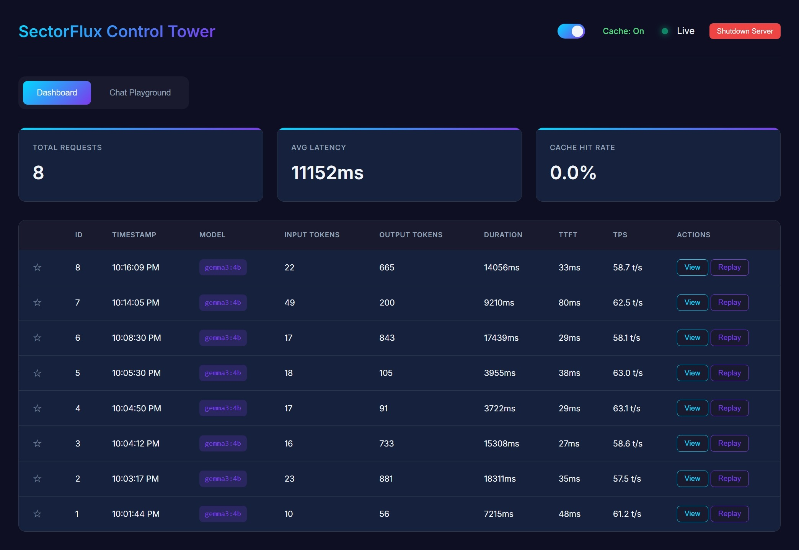
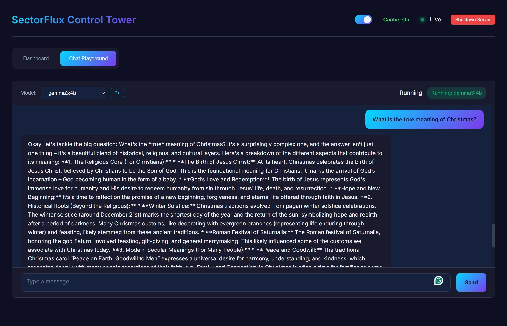

<p align="center">
  <h1 align="center">SectorFlux</h1>
  <p align="center">
    <strong>Monitor, Debug, Optimize Your Local AI</strong>
  </p>
  <p align="center">
    A lightweight, high-performance flight recorder for local LLM agents.
  </p>
  <p align="center">
    <a href="https://sectorflux.particlesector.com">Website</a> •
    <a href="#quick-start">Quick Start</a> •
    <a href="#features">Features</a> •
    <a href="#documentation">Documentation</a>
  </p>
</p>

---

SectorFlux is a native C++ reverse proxy that sits between your application and Ollama, providing real-time monitoring, logging, and debugging capabilities with minimal resource overhead. Think of it as **htop for your local AI**.

<p align="center">
  
</p>
<p align="center">
  
</p>

## Why SectorFlux?

When developing with local LLMs, you need visibility into what's happening:

- **What prompts are being sent?** See every request in real-time
- **How fast is my model?** Track tokens per second, time-to-first-token
- **What went wrong?** Full request/response history for debugging
- **Can I test quickly?** Built-in chat playground, no external tools needed

All this in a **single ~10MB binary** with zero dependencies.

## Features

| Feature | Description |
|---------|-------------|
| **Real-time Streaming Proxy** | Transparent forwarding with live token streaming |
| **Request/Response Logging** | Complete history of all LLM interactions |
| **Performance Metrics** | Token counts, latency, TPS, and TTFT |
| **Smart Caching** | Optional response caching to reduce redundant API calls |
| **Chat Playground** | Test prompts directly from the dashboard |
| **Request Replay** | Re-run any logged request with one click |
| **Single Binary** | No Node.js, no Python, no dependencies |
| **Low Resource Usage** | Native C++ with embedded SQLite (~10MB RAM) |

## Quick Start

### Prerequisites

- [Ollama](https://ollama.ai/) running locally (default: `http://localhost:11434`)
- CMake 3.20+
- C++20 compatible compiler (MSVC 2022, GCC 11+, Clang 14+)

### Build from Source

```bash
# Clone the repository
git clone https://github.com/particlesector/sectorflux.git
cd sectorflux

# Create build directory
mkdir build && cd build

# Configure and build
cmake ..
cmake --build . --config Release
```

### Run

```bash
# Windows
./build/Release/SectorFlux.exe

# Linux/macOS
./build/SectorFlux
```

SectorFlux starts on port **8888** and automatically opens your browser to the dashboard.

### Connect Your App

Just change your Ollama port from `11434` to `8888`:

```python
# Before (direct to Ollama)
client = OpenAI(base_url="http://localhost:11434/v1", api_key="ollama")

# After (through SectorFlux)
client = OpenAI(base_url="http://localhost:8888/v1", api_key="ollama")
```

That's it. Your dashboard is now live at `http://localhost:8888`.

## Documentation

### Dashboard

| Tab | Description |
|-----|-------------|
| **Dashboard** | Live metrics, recent requests, starred items, and quick actions |
| **Chat Playground** | Interactive chat interface for testing models |

### Metrics

| Metric | Description |
|--------|-------------|
| **Input Tokens** | Number of tokens in the prompt |
| **Output Tokens** | Number of tokens generated |
| **Duration** | Total request time (end-to-end) |
| **TTFT** | Time To First Token - prompt processing latency |
| **TPS** | Tokens Per Second - generation speed |

### API Reference

#### Proxy Endpoints (forwarded to Ollama)

| Endpoint | Method | Description |
|----------|--------|-------------|
| `/api/generate` | POST | Text generation (streaming) |
| `/api/chat` | POST | Chat completion (streaming) |
| `/api/tags` | GET | List available models |
| `/api/ps` | GET | List running models |

#### SectorFlux API

| Endpoint | Method | Description |
|----------|--------|-------------|
| `/api/logs` | GET | Get all logged requests |
| `/api/logs/:id` | GET | Get specific log entry |
| `/api/logs/:id/starred` | PUT | Star/unstar a log entry |
| `/api/replay/:id` | POST | Replay a logged request |
| `/api/metrics` | GET | Get aggregated metrics |
| `/api/version` | GET | Get SectorFlux version |
| `/api/config/cache` | GET/POST | Get/set cache configuration |
| `/api/shutdown` | POST | Gracefully shutdown server |

#### WebSocket Endpoints

| Endpoint | Description |
|----------|-------------|
| `/ws/chat` | Streaming chat interface |
| `/ws/dashboard` | Real-time dashboard updates |

### Configuration

#### Environment Variables

| Variable | Default | Description |
|----------|---------|-------------|
| `OLLAMA_HOST` | `http://localhost:11434` | Ollama server address |
| `SECTORFLUX_PORT` | `8888` | SectorFlux listening port |
| `SECTORFLUX_DB` | `sectorflux.db` | SQLite database path |

#### Cache Control

Disable caching for specific requests:

```bash
curl -H "X-SectorFlux-No-Cache: true" http://localhost:8888/api/generate -d '...'
```

Or toggle globally via the dashboard or API:

```bash
curl -X POST http://localhost:8888/api/config/cache -d '{"enabled": false}'
```

## Performance

SectorFlux adds approximately **20-40% overhead** compared to direct Ollama calls. This is expected for a streaming monitoring proxy and includes:

- Streaming response forwarding
- Request/response logging with metrics extraction
- Cache lookup and storage

| Scenario | Direct Ollama | Through SectorFlux | Overhead |
|----------|---------------|-------------------|----------|
| Simple prompt (60 tokens) | ~1.4s | ~1.8s | ~30% |
| Medium prompt (150 tokens) | ~3.0s | ~4.0s | ~33% |

> **Note:** Token generation speed (TPS) remains consistent—the overhead is primarily in streaming/network handling, not model inference.

### Ideal Use Cases

- Development and debugging of LLM agents
- Performance benchmarking and optimization
- Logging conversations for review/audit
- Testing different prompts and models

## Technical Stack

| Component | Technology |
|-----------|------------|
| Language | C++20 |
| Web Framework | [Crow](https://crowcpp.org/) v1.3.0 |
| Database | SQLite3 (WAL mode) |
| HTTP Client | [cpp-httplib](https://github.com/yhirose/cpp-httplib) |
| JSON | [nlohmann/json](https://github.com/nlohmann/json) |
| Build | CMake with FetchContent |

## Project Structure

```
SectorFlux/
├── CMakeLists.txt              # Build configuration
├── LICENSE                     # GPL-3.0 license
├── LICENSE-COMMERCIAL          # Commercial license info
├── LICENSING.md                # Licensing guide
├── src/
│   ├── main.cpp                # Entry point, route definitions
│   ├── config.hpp              # Configuration management
│   ├── version.hpp.in          # Version template (CMake generated)
│   ├── database.cpp/hpp        # SQLite wrapper with async logging
│   ├── proxy.cpp/hpp           # Ollama proxy with streaming
│   └── embedded_ui.hpp         # Auto-generated UI assets
├── public/                     # Dashboard frontend
│   ├── index.html
│   ├── style.css
│   ├── app.js
│   └── api.js
└── scripts/
    └── embed_ui.py             # Embeds public/ into C++ header
```

## Development

### Rebuilding the UI

After modifying files in `public/`:

```bash
python scripts/embed_ui.py
cmake --build build --config Release
```

### Debug Build

```bash
cmake --build build --config Debug
```

## License

SectorFlux is dual-licensed:

- **Open Source:** [GPL-3.0](LICENSE) for open source use
- **Commercial:** [Commercial License](LICENSE-COMMERCIAL) for proprietary applications

This means you can:
- Use SectorFlux freely in open source projects (GPL-3.0)
- Purchase a commercial license if you need to use it in closed-source/proprietary software

For commercial licensing inquiries, contact: **licensing@particlesector.com**

See [LICENSING.md](LICENSING.md) for detailed information.

## Contributing

Contributions are welcome! Please feel free to submit issues and pull requests.

1. Fork the repository
2. Create your feature branch (`git checkout -b feature/amazing-feature`)
3. Commit your changes (`git commit -m 'Add amazing feature'`)
4. Push to the branch (`git push origin feature/amazing-feature`)
5. Open a Pull Request

## Links

- **Website:** [sectorflux.particlesector.com](https://sectorflux.particlesector.com)
- **GitHub:** [github.com/particlesector/sectorflux](https://github.com/particlesector/sectorflux)
- **Issues:** [github.com/particlesector/sectorflux/issues](https://github.com/particlesector/sectorflux/issues)

## Acknowledgments

- [Ollama](https://ollama.ai/) - Local LLM runtime
- [Crow](https://crowcpp.org/) - Fast C++ web framework
- [cpp-httplib](https://github.com/yhirose/cpp-httplib) - Header-only HTTP client
- [nlohmann/json](https://github.com/nlohmann/json) - JSON for Modern C++

---

<p align="center">
  Made with care by <a href="https://particlesector.com">ParticleSector</a>
</p>
